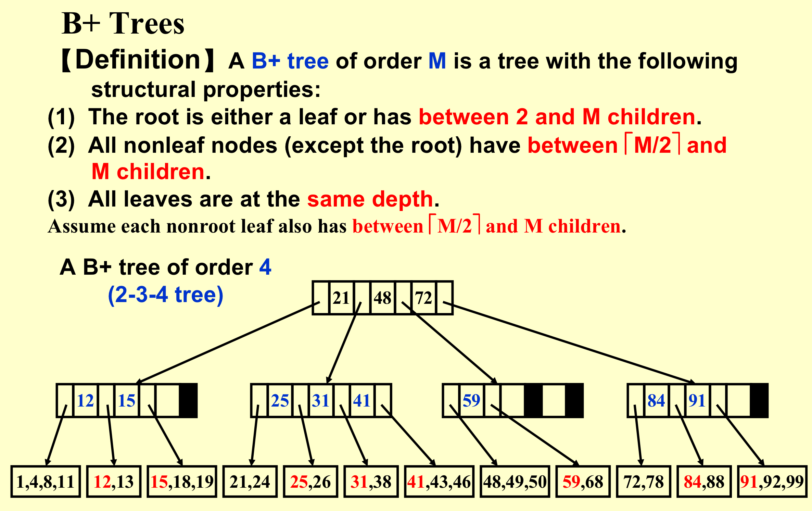
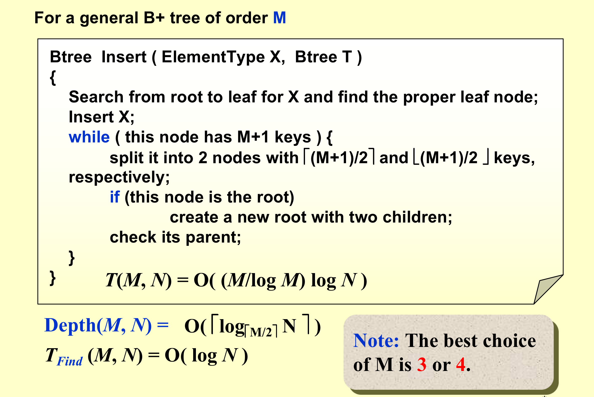
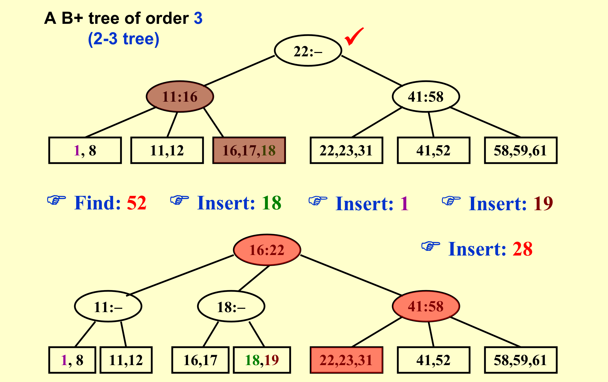
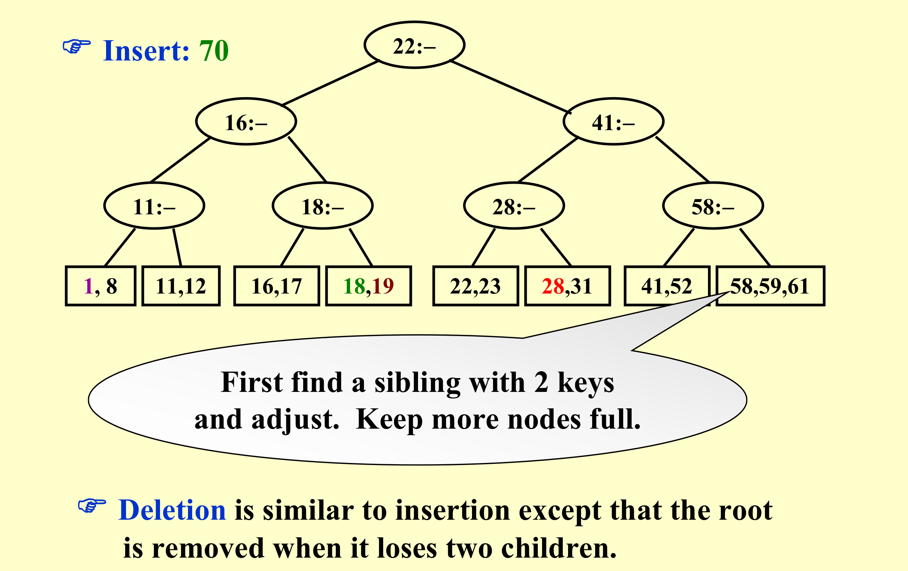

# B+ Tree
> 常用于数据库和操作系统的文件系统中

!!! note "B+ Tree 的定义"
    - 对于一颗**M阶B+树**有一下的性质：
        - 根结点要么是一个**leaf**,要么其子结点的个数为**2到M个**
        - 任何除去根的非叶结点的子结点的数目为**$\lceil \frac{M}{2} \rceil$**到M个。
        - 所有的叶结点都处在相同的高度上
    - 关于文件索引的特性：
        - 所有的非叶结点都是一个索引结点，不存储真实的数据的信息，对于有**K**颗子树的结点，有**K**个指针指向子树，以及**(K-1)**个数值用于按顺序存储每棵子树的最小值（除去第一棵）。每个非叶结点就像路牌一样，最终指向了要访问的结点，由此可以理解**B+ Tree**的基本操作 
        - 所有的数据的信息都存放在**叶结点**上 
    - 

!!! tip "一些补充"
    - 注意：当从一颗空树开始插入时，先是从一个叶子开始生长的。
    - 当一个结点是**叶结点**时，它最多容纳的元素数目为 M ，即当插入使得其数目为(M+1)个数据时，就要进行分裂
    - 在进行删除时我们要考虑叶结点最少的元素数目，它应当是：**$\lceil \frac{M}{2} \rceil$**到M个。（根据分裂后叶结点的数目推出）
    - 当一个结点是**索引结点**时，它会有 M 颗子树，有（M-1）个索引值。

!!! note "B+ Tree 的基本操作"
    - 在查找的过程中我们根据非叶结点的索引来指示要访问的子树，索引结点的数据都是按顺序排放的，因此我们需要$O(\log(M))$的时间来对一个索引结点进行查找。
    - 在插入的过程中，我们需要进行**分裂**的操作，如果叶结点的数据数目大于**（ M + 1）**, 或者索引结点的子树个数大于 （M+1）， 我们便需要进行分裂的操作，将这个不个符合要求的结点一分为二（可能将问题向上传递）
    - Depth(M, N) = $\lceil  \log~\lceil \frac{M}{2} \rceil~N \rceil$
    - T_find (M, N) = log(M) * log(N)/log(M) = log(M)
    - 

!!! tip "Example"
    - 
    - 

