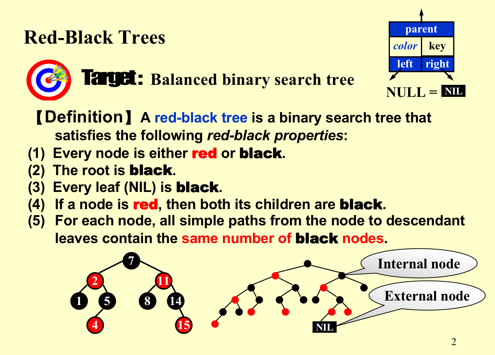
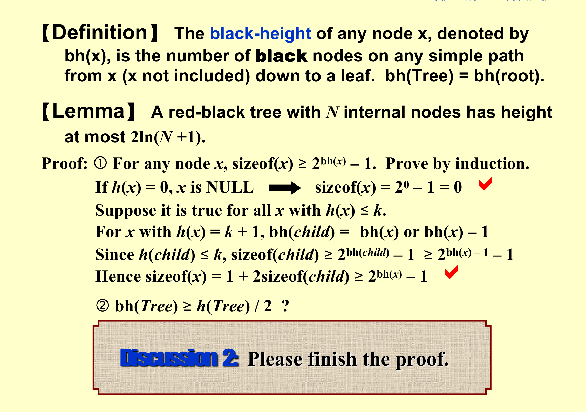
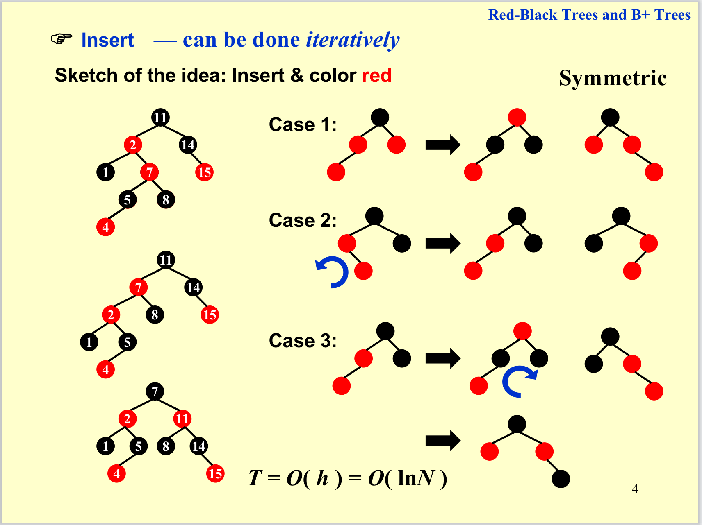
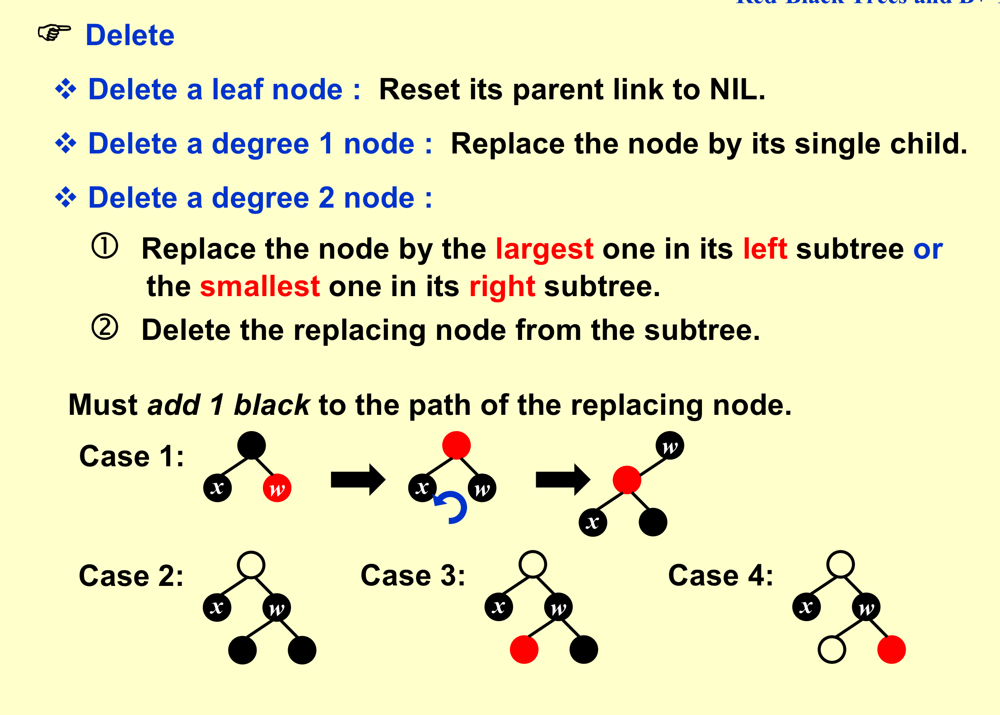
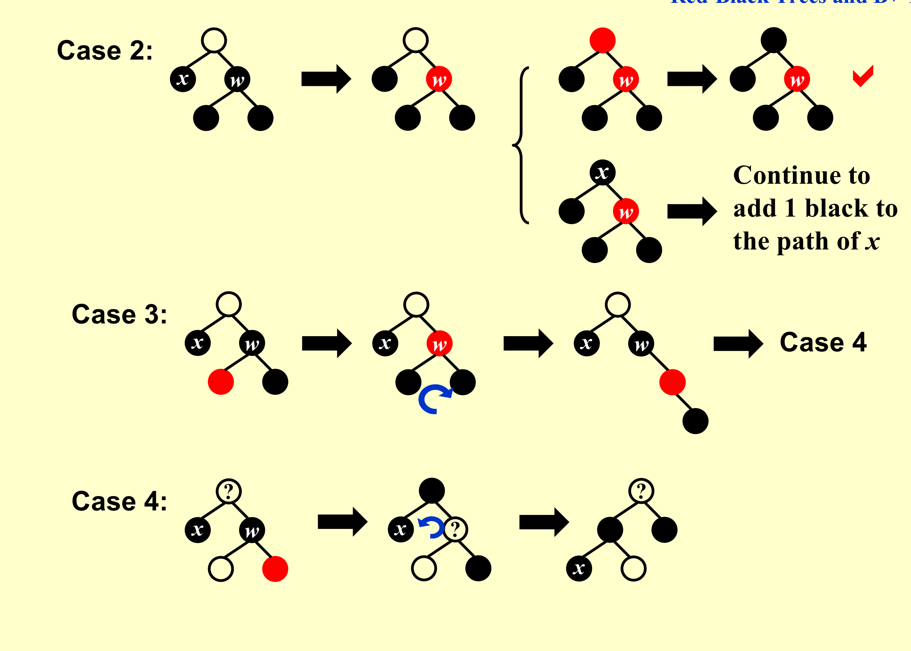
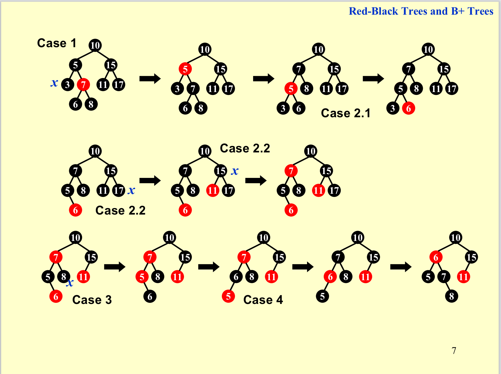
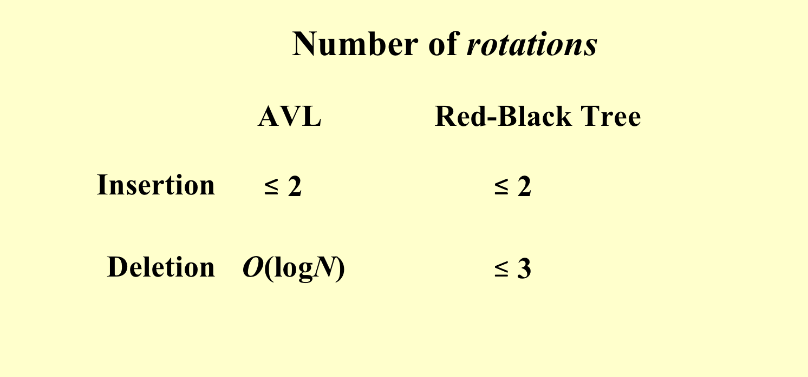

# 红黑树 

!!! note "定义"
   
    - **性质4**表明：一定不会有两个连续的红色结点出现，基于这个性质我们要进行**插入**操作的调整。
    - **性质5**:在每个节点到后代的路径上，**黑高**都是相等的，红色的结点被夹在黑色的结点之中起到一个缓冲的作用。基于这个性质我们要进行**删除**操作的调整。
    - **性质3:** 其中的**NIL**，在《算法导论》用一个哨兵结点来实现，所有的叶结点和根节点都指向了同一个根--**NIL**, **NIL**相当于唯一的一个叶结点。
    - 红黑树可以保证没有任何一条路径比其他路径长2倍，也可以确保一个较好的平衡的性质。
    -  -  

!!! success "NIL"
    注意我们将叶结点定义为了一个**External Node**, 它是一个唯一的叶结点, 这个设定将有助于我们理解下面的定义和操作。

!!! tip "关于树高"
    
    - 红色结点夹在黑色结点之间起到了一个**缓冲**的作用，但在任何一条路径上红色结点的个数都不会超过一半，因此会有这样的高度的性质。
    - 如果我们只关注黑结点的话，实际上它具备了完全二叉树的结构。
    -  

!!! note "插入操作"
    - 新插入的结点的颜色**一定为红色**
    - 如果插入的是**空树**，或者**父节点为黑色**，这两种情况都较为平凡，不会对红黑树的性质造成破坏。我们要关心的调整是**双红结点**的情况的调整。
    - **case1**: **父叔同红，父组换色祖上传**，则将父结点、叔结点、祖父结点进行**换色**。此时我们将问题**向上传递**给了祖父结点，如果祖父结点为根结点则只需将红色转为黑色即可，如果不是我们将祖父结点继续向上进行 Insert 的调整，直到将问题转变到根上即可，这是一种**自底向上的调整策略**
    - **case2**:**叔黑子内，父子旋转使子外**，我们将情况转化为**case3**
    - **case3**:**叔黑子外，父祖换色父旋升** 
    - 

!!! note "删除操作"
    - 删除叶结点：让父结点连接到**NIL** 。
    - 删除一度的结点：用它唯一的孩子来替换它。
    - 删除两度结点：用左子树的最大值（或右子树的最小值）来对要删除的结点的数值进行替换，并且要**保持颜色**，然后将替换结点的位置删去，这样问题就转化为了前两种情况。
    - 在删除时我们主要面临的问题在于**黑色结点**的删除，由于我们都可以将问题转化为删除**叶结点**或**一度结点**的情况，因此只需要关心这两种情况，我们的思路便是：**在包含要删除的结点x所在的路径上都添加一个黑色的结点**，这样删去x后我们便可以保证**性质5**不被破坏。

    !!! success "删除黑结点的case" 
        - 注意： **NIL**的作用在这个过程中的体现
        - case1:**兄红转兄黑。 父兄换色兄旋升**。这样将问题转化为兄黑的下面的三种情况。
        - case2:**兄侄全黑则兄红，黑父不当则上传**。首先我们将兄的颜色转化为红色，如果原本的父结点为红色那么我们将其转化为黑色即可；如果父结点为黑色，我们便将问题向上进行传递。如果传递到了根那么问题自然就得到了解决
        !!! tip "传递到根时问题自然得到解决的原因"
            -  在case2时，若父结点是红色，我们采用的操作可以保持右边的路黑高不变，左边的路黑高增加1（对于删除结点的路径黑高确切的增加了1，如果由于向上传递受到关联的其他路径由于黑转红可以通过这个黑结点来补充损失的一个黑色点）。
            -  若父结点为黑色，我们的操作会导致右路黑高减少一个，从而左边的路在删除之前会比右边多1，问题便自然得到了解决。
        - case3:**兄黑远黑近侄红，侄兄换色侄旋升**，将问题转化为case4。
        - case4:**兄黑远红化其黑，父兄换色兄旋升**，问题在这一步得到解决。
        -  
        -  
    !!! tip "一个具体的例子"
        - 

!!! note "旋转次数分析"
    - 由于在红黑树的插入和删除的操作中，我们多数进行的都是颜色的调换，进行的旋转操作较少。
    - 
