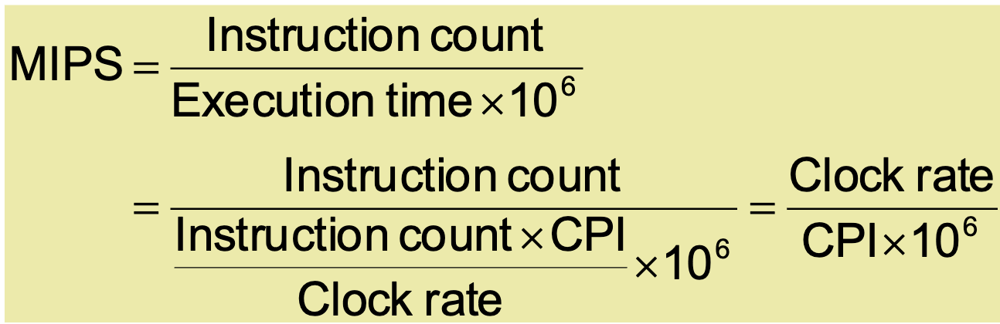
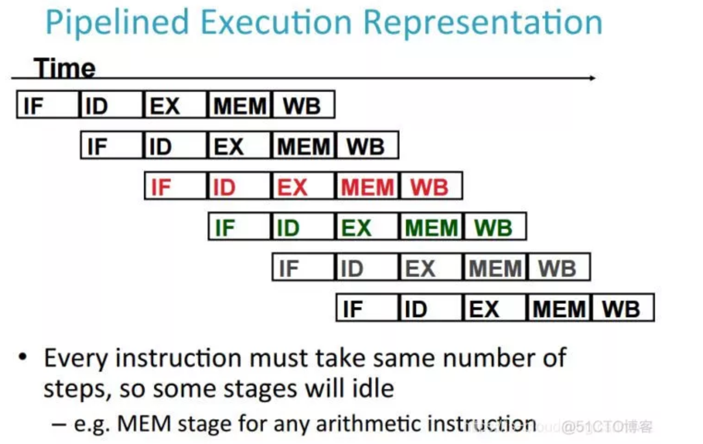
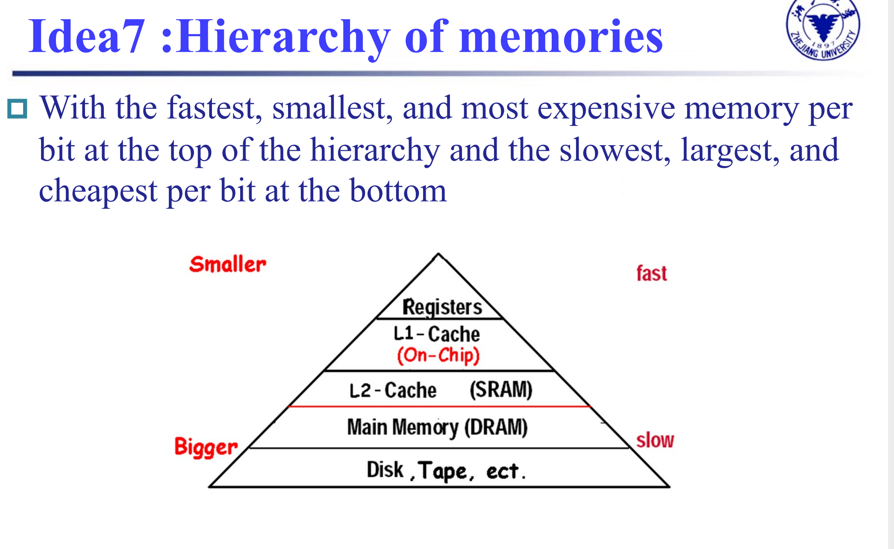

## Chapter1: Computer Abstraction and Technology

### Computer design: performance and idea 

!!! note "Response time/execution time"
    * 响应时间/执行时间
    * How long it takes to do a task
    * 执行一项任务时花费的时间,往往是用户所关注的
    * 可以通过提升处理器性能来增加

!!! note "Throughput (bandwidth)"
    - 吞吐率
    - Total work done per unit time
    - 在同一时间可以处理事物的总量
    - 可以通过多核处理的方式来增加

!!! note "Relative Performance"
    - 借助执行的时间来对性能进行描述 
    - Define Performance = 1/Execution Time

!!! note "Elapsed time"
    - 所有运行时间的总和
    - Total response time, including all aspects:
    - Processing, I/O, OS overhead, idle time
    - Determines system performance

!!! note "CPU time"
    - Time spent processing a given job:
        - Discounts I/O time, other jobs’ shares
    - **Clock period**: duration of a clock cycle
        - **Clock frequency (rate):** cycles per second
    - **CPI**: 指令的平均时钟周期数目(cycles per instruction)
        
        - 计算CPI:  
            - $$Clock\ Cycles =  \sum{CPI_i \times Instruction \ Count_i}$$
                   
            - $$CPI = \frac{Clock\  Cycles}{Instruction\  Count}$$ 
    - !!! question "如何计算"
        - $$CPU\ Time = CPU \ Clock \ Cycles \times Clock \ Cycle \ Time  \ = \frac{CPU \ Clock \ Cycles}{Clock \ Rate} $$ 
            - 通过此式我们可以看出提升性能的方法:
                - Reducing number of clock cycles
                - Increasing clock rate
                - Hardware designer must often trade off clock rate against cycle count
        - $$ Clock\ Cycles = Instruction \ Count  \times Cycles \ per \ Instruction   $$
        - $$ CPU\ Time \ = \frac{Instruction Count \times CPI}{Clock Rate}  $$

    - 通过CPU time 的计算我们可以知道性能提升的方法:
        - **Algorithm**: affects IC, possibly CPI
        - **Programming language:** affects IC, CPI
        - **Compiler:** affects IC, CPI
        - **Instruction set architecture:** affects IC, CPI, Tc

!!! note "功耗分析"
    - $$Power = Capacitive \ load \times Voltage^2 \times Frequency $$

!!! note "Pitfall: Amdahl’s Law"
    - 改进计算机的一个方面并期望整体性能按比例提高
    - $$T_improved\ = \frac{T_affected}{improvement factor} \ + T_unaffected$$
    ???+ 举例
        - 在指令中乘法运算占据80%, 加法占据20%. 我们通过提升乘法的速度来提升整体的性能.

!!! note "MIPS"
    - **MIPS:** Millions(百万) of Instructions Per Second
        -  Doesn’t account for **Differences in ISAs** between computers and **Differences in complexity** between instructions
???+ 如何计算MIPS
      

!!! note "Eight Great Ideas"
    - Design for Moore’s Law （设计紧跟摩尔定律）
    - Use Abstraction to Simplify Design (采用抽象简化设计)
    - Make the Common Case Fast (加速大概率事件)
    - Performance via Parallelism (通过并行提高性能)
    - Performance via Pipelining (通过流水线提高性能)
    - Performance via Prediction (通过预测提高性能)
    - Hierarchy of Memories (存储器层次)
    - Dependability via Redundancy (通过冗余提高可靠性)

???+ 简单理解流水线
    - 每个步骤要划分成等长的时间、因此要将每个步骤的时间尽可能划分的相等。
    

???+ 存储器层次
    

