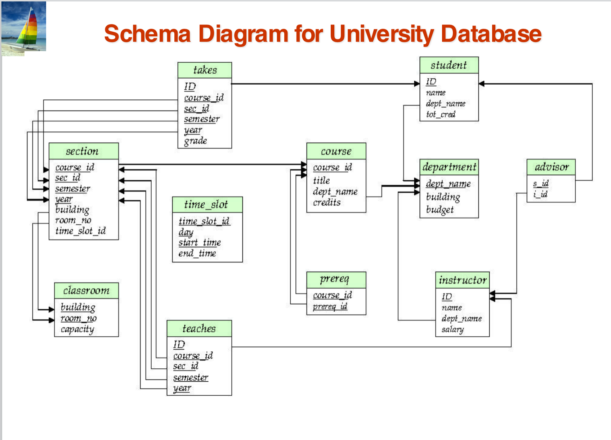
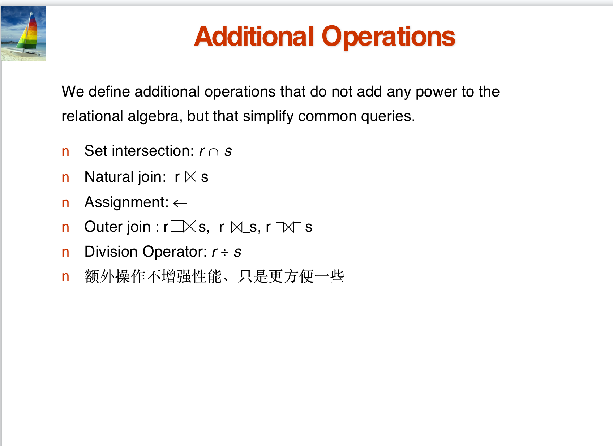
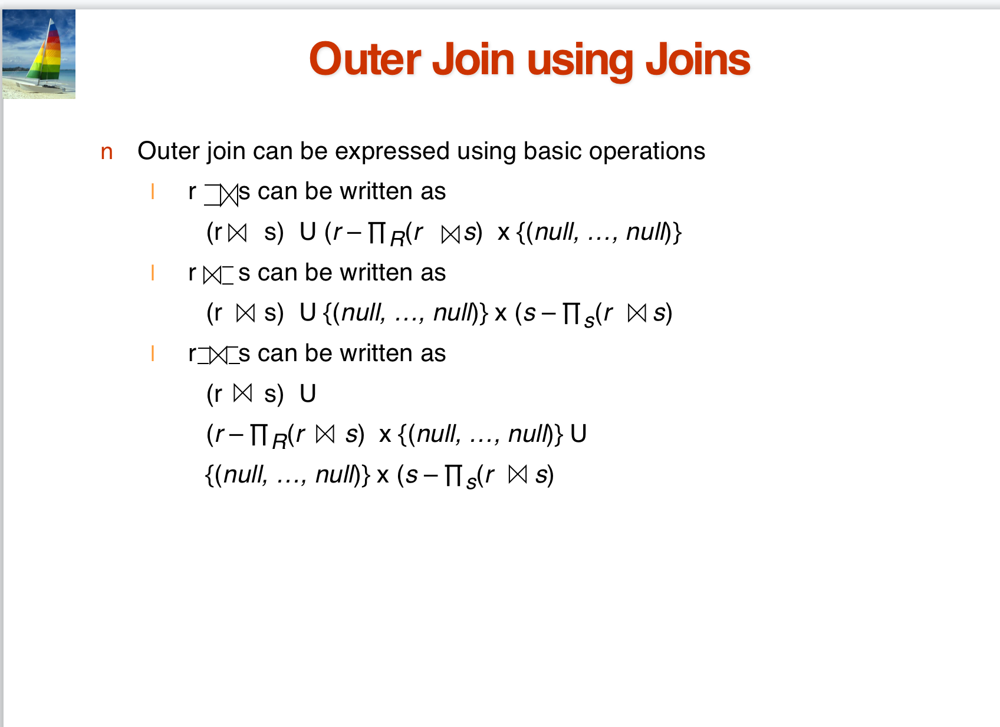
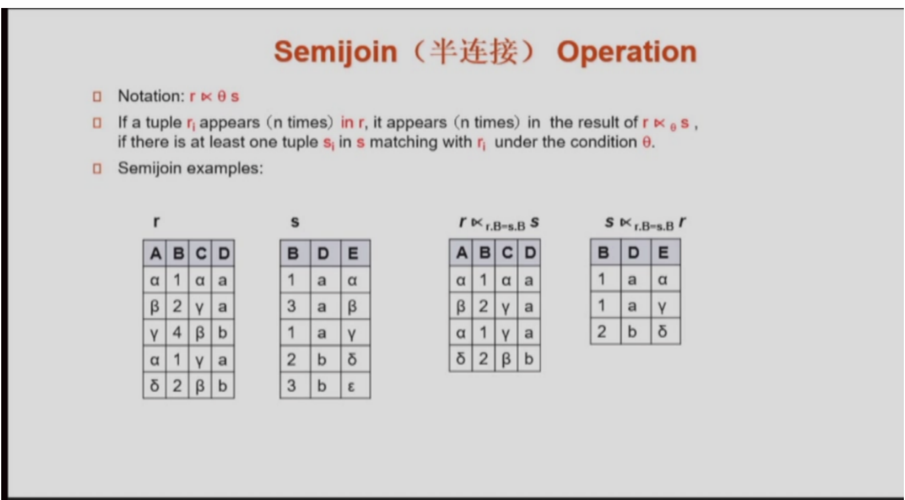
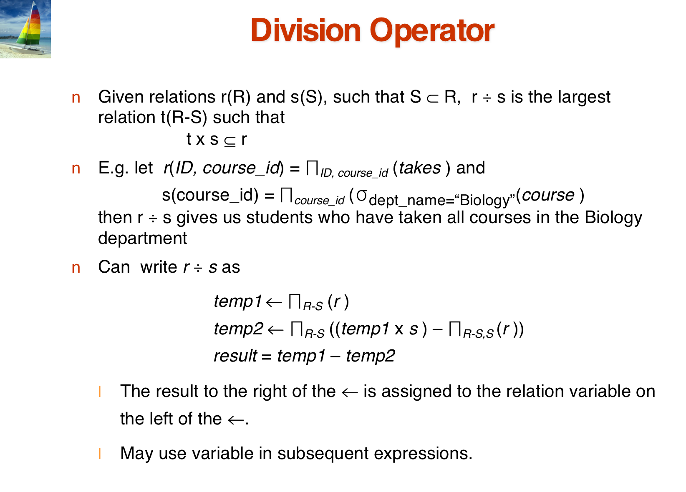
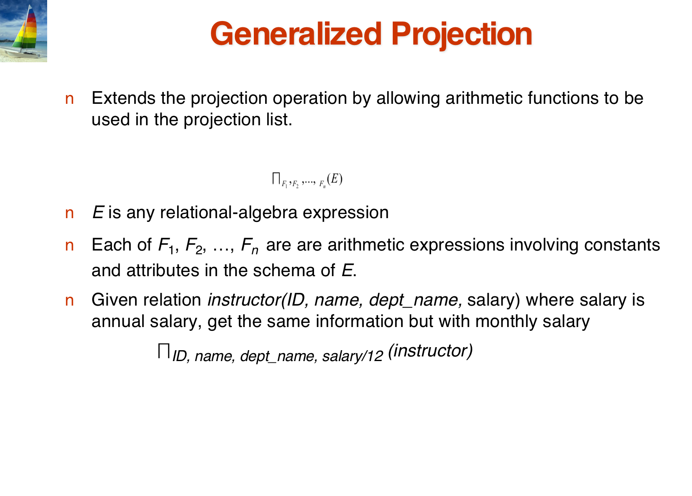
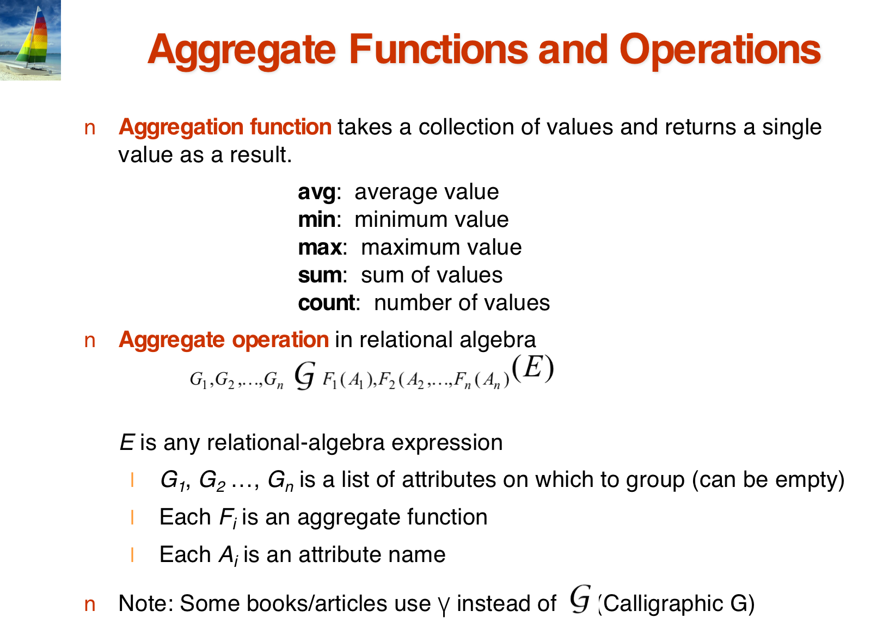
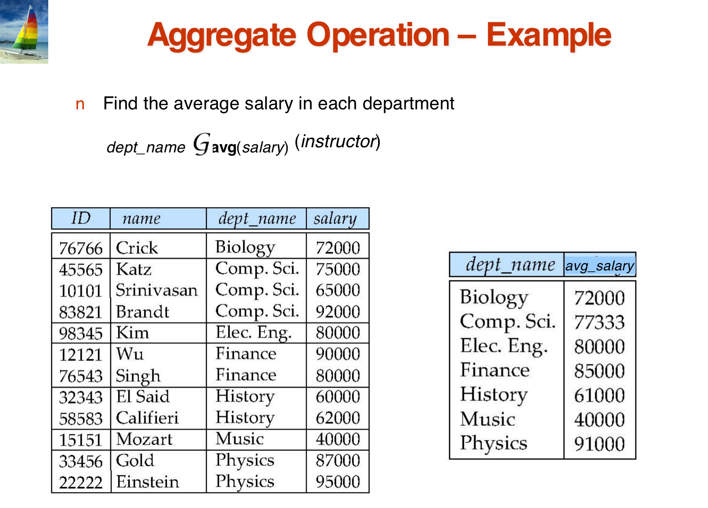
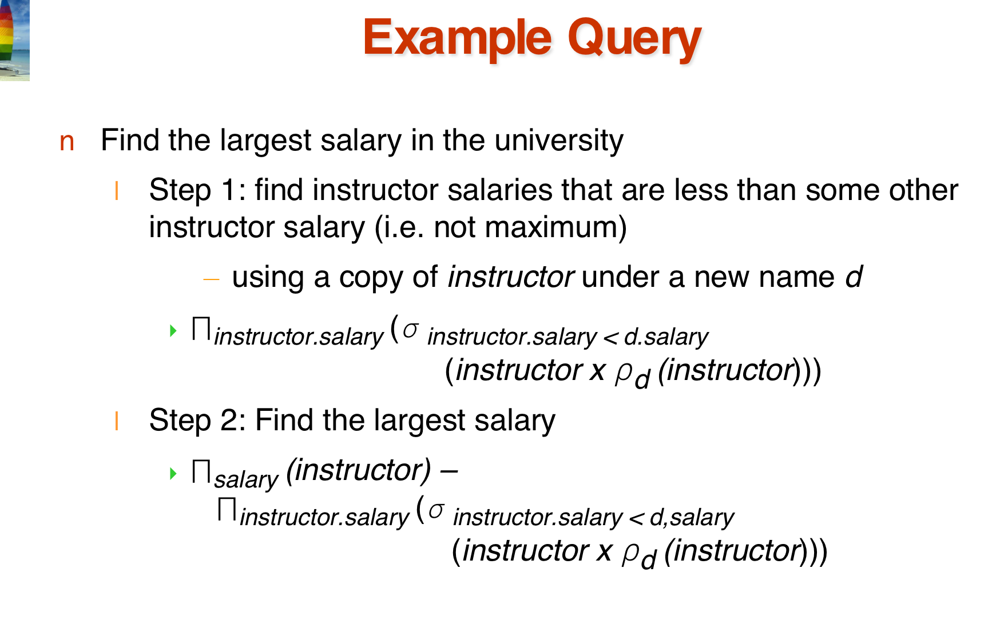

# Lecture2 Relation Model 
> Chapter 2: Introduction to Relational Model
> Chapter 6.1: Relational Algebra

## 1. Relation Model 

!!! note "Example of a Relation(or Table)"
        - 在一个 Table 中我们关心：
        - **attributes**:指属性，Table 中的每一列（ ）
        - **tuples**: 每一行组成的元组

!!! note "Basic Structure"
    - Formally, given sets $D_1, D_2 ... D_n$ a **relation** r is a subset of $D_1 \times D_2 \times ... \times D_n$, Thus, a relation is a set of n-tuples $(a_1, a_2, ..., a_n)$, where each $a_i \in D_i$

    !!! success "Attribute Types"
        - The set of allowed values for each **attribute(属性)** is called the **domain（域** of the attribute.
        - Attribute values are (normally) required to be **atomic（原子的）**; that is, indivisible
        - The special value **null （空值）** is a member of every domain
        - The null value causes complications in the definition of many operations
        - Relations are **unordered**,是一种无序的集合

    !!! tip "R/r"
        - R = $(A_1, A_2, ... , A_n)$ is relation schema 
            - 可以理解为属性名字的集合 
        - r(R) denotes a relation r on the relation schema R
    
    - **Relation instance** vs **Relation schema**

!!! note "About Key"
    - let $K \subseteq R$ 
    - K is a **superkey(超健)**  of R if values for K are sufficient to identify a unique tuple of each possible relation r(R) , 即可以将表中的实例进行唯一的区分。
    ???+ example
        - Example:  {ID} and {ID,name} are both superkeys of instructor.
    - Superkey K is a **candidate key(候选健)**  if K is minimal（没有冗余属性）
    ???+ example 
        - {ID} is a candidate key for Instructor
    - One of the candidate keys is selected to be the **primary key（主键）**.
    - **Foreign key（外键）** constraint: value in one relation must appear in another，指向另一个表，类比于C语言的指针。并且它必须指向了另一个表中的**primary key（主键）**，同时 A 中的值一定的它指向的表 B 中存在。
    - **Referential integrity(参数完整性)**: 与 **Foreign key** 相比，可以不要求它指向的内容是**primary key（主键）**。
    - 

## 2. Relational Query Languages

!!! note "Relational Algebra"
    !!! success "Six basic operators"
        - select:$\sigma$, \ 选择满足条件的tuple,进行横向选择
        - project: $\prod$ \ 进行纵向选择
        - union: $\cup$ \ **compatible**:要保证数据的兼容
        - set difference: –  **compatible**:要保证数据的兼容
        - Cartesian product(笛卡尔积): $\times$ \ 将内容无脑的排列起来， 通常在乘起来后再进行 select
        - rename: $\rho$

    !!! sucess "Additional Operations"
        - 

        !!! tip "Natural-Join Operation"
            对乘法操作的补充：只对**公共属性相同**的行进行保留 
 
        !!! tip "Outer Join"
            - 
            - 对 Natural-Jion 的操作进行补充，对于在两个表中找不到相同的公共属性时，我们用 **null**, 进行补充，并且添加到表中。（分为 左/右/左右 的三种情况） 

        !!! tip "半连接"
            - 

        !!! tip "除法"
            - 

        !!! tip "Generalized Projection"
            - 

        !!! tip "Aggregate Functions and Operations"
            - 
            - 

!!! success "关系代数使用的例子"
    