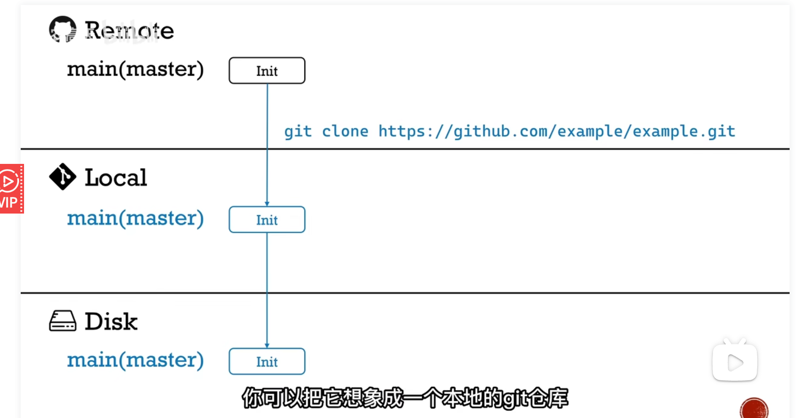
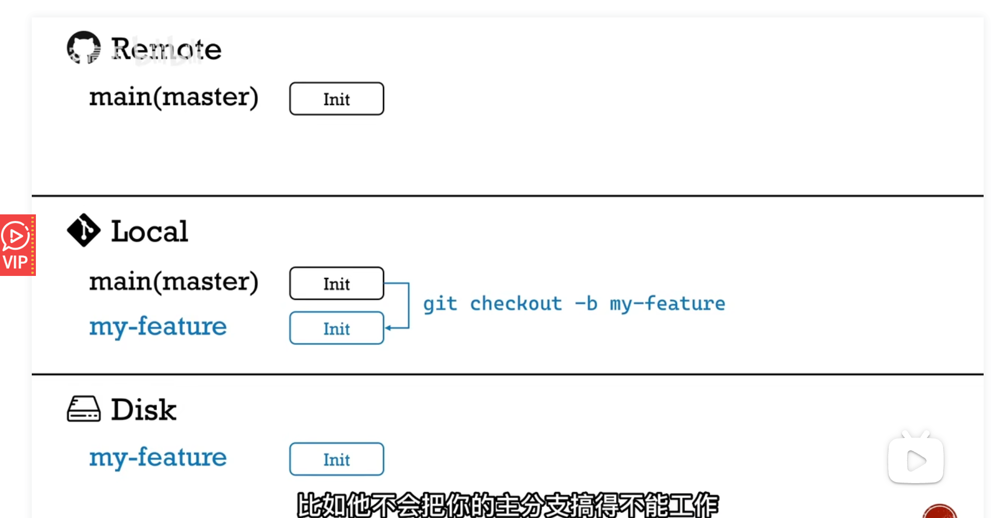

# git/github 

[github工作流](https://www.bilibili.com/video/BV19e4y1q7JJ/?vd_source=ddafcda1d76dfcb6a15262317240f000)

!!! note "github 工作流"
    - 
    - 
        - 提交回 github 中：`git push origin my-feature` 
    - 

!!! note "常用指令"
    - `git add .`
    - `git commit -m "..."`
    - `git push -u origin main` 
    - `git checkout -b my-feature`:建立一个自己的新分支
    - `git checkout main`
    - `git pull origin master`:同步远端的更新
    - `git rebase main`: 先同步最新的**main**,然后在尝试加入自己的变化。可能比**merge更好**